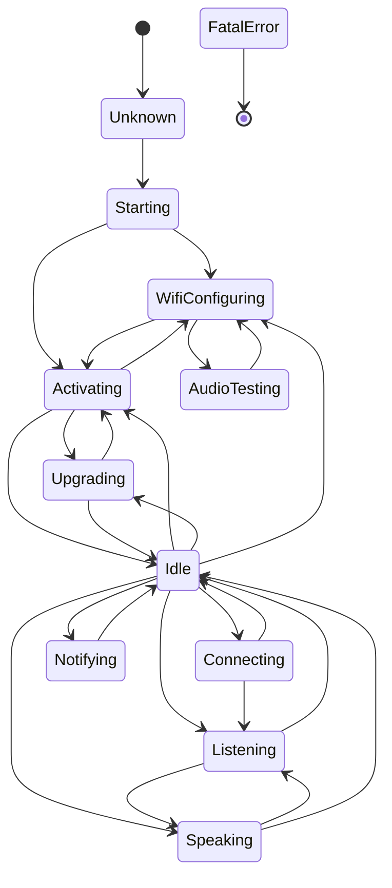

# Xiaozhi State Machine — Stati e transizioni del firmware ESP32 stock

> Derivata dal codice firmware `_upstream/xiaozhi-esp32`. Non usare una state machine inventata.

Fonte: `main/device_state.h` (enum `DeviceState`) e `main/device_state_machine.cc` (`IsValidTransition`).

---

## Stati

Definiti in `device_state.h:4-15`:

| # | Nome | Descrizione |
|---|---|---|
| 0 | `Unknown` | Stato iniziale prima dell'avvio |
| 1 | `Starting` | Avvio del sistema |
| 2 | `WifiConfiguring` | Configurazione WiFi in corso |
| 3 | `Idle` | Inattivo, in attesa di input |
| 4 | `Connecting` | Connessione WebSocket/MQTT in corso |
| 5 | `Listening` | Microfono attivo, cattura audio |
| 6 | `Speaking` | Riproduzione TTS in corso |
| 7 | `Notifying` | Notifica in corso |
| 8 | `Upgrading` | Aggiornamento firmware (OTA) |
| 9 | `Activating` | Attivazione/registrazione device |
| 10 | `AudioTesting` | Test audio |
| 11 | `FatalError` | Errore fatale (terminale) |

---

## Transizioni

Derivate da `device_state_machine.cc:37-93`. Ogni transizione è validata da `IsValidTransition(from, to)`.

### Tabella transizioni dettagliata

| Da | A | Evento | Direzione | Messaggio protocollo | File firmware | Riga |
|---|---|---|---|---|---|---|
| `Unknown` | `Starting` | Avvio sistema | interno | — | `device_state_machine.cc` | 42 |
| `Starting` | `WifiConfiguring` | Network non configurato | interno | — | `device_state_machine.cc` | 46 |
| `Starting` | `Activating` | Network già configurato | interno | — | `device_state_machine.cc` | 47 |
| `WifiConfiguring` | `Activating` | WiFi connesso | interno | — | `device_state_machine.cc` | 51 |
| `WifiConfiguring` | `AudioTesting` | Test audio | interno | — | `device_state_machine.cc` | 52 |
| `AudioTesting` | `WifiConfiguring` | Test completato | interno | — | `device_state_machine.cc` | 55 |
| `Activating` | `Upgrading` | OTA disponibile | server → device | `{"type":"system","command":"upgrade"}` | `device_state_machine.cc` | 59 |
| `Activating` | `Idle` | Attivazione completata | interno | — | `device_state_machine.cc` | 60 |
| `Activating` | `WifiConfiguring` | Errore attivazione | interno | — | `device_state_machine.cc` | 61 |
| `Upgrading` | `Idle` | Upgrade fallito/completato | interno | — | `device_state_machine.cc` | 65 |
| `Upgrading` | `Activating` | Upgrade completato | interno | — | `device_state_machine.cc` | 66 |
| `Idle` | `Connecting` | Avvio sessione vocale | device → server | `hello` | `device_state_machine.cc` | 71 |
| `Idle` | `Listening` | Wake word / button | device → server | `{"type":"listen","state":"start"}` | `device_state_machine.cc` | 72 |
| `Idle` | `Speaking` | Notifica | server → device | `{"type":"tts","state":"start"}` | `device_state_machine.cc` | 73 |
| `Idle` | `Notifying` | Notifica locale | interno | — | `device_state_machine.cc` | 74 |
| `Idle` | `Activating` | Riactivation | interno | — | `device_state_machine.cc` | 75 |
| `Idle` | `Upgrading` | OTA | server → device | `{"type":"system","command":"upgrade"}` | `device_state_machine.cc` | 76 |
| `Idle` | `WifiConfiguring` | Network lost | interno | — | `device_state_machine.cc` | 77 |
| `Connecting` | `Idle` | Connessione fallita | interno | — | `device_state_machine.cc` | 81 |
| `Connecting` | `Listening` | Connessione OK + hello | server → device | `{"type":"hello",...}` | `device_state_machine.cc` | 82 |
| `Listening` | `Speaking` | VAD end / risposta pronta | server → device | `{"type":"tts","state":"start"}` | `device_state_machine.cc` | 86 |
| `Listening` | `Idle` | Timeout / cancelled | device → server | `{"type":"listen","state":"stop"}` | `device_state_machine.cc` | 87 |
| `Speaking` | `Listening` | Barge-in / wake word | device → server | `{"type":"abort","reason":"wake_word_detected"}` | `device_state_machine.cc` | 91 |
| `Speaking` | `Idle` | TTS completato | interno | — | `device_state_machine.cc` | 92 |
| `Notifying` | `Idle` | Notifica completata | interno | — | `device_state_machine.cc` | 95 |

---

## Eventi del main loop

Definiti in `main/application.h:20-33`:

| Evento | Bit | Descrizione |
|---|---|---|
| `MAIN_EVENT_SCHEDULE` | 1<<0 | Task schedulato |
| `MAIN_EVENT_SEND_AUDIO` | 1<<1 | Invia audio al server |
| `MAIN_EVENT_WAKE_WORD_DETECTED` | 1<<2 | Wake word locale rilevato |
| `MAIN_EVENT_VAD_CHANGE` | 1<<3 | Cambio stato VAD |
| `MAIN_EVENT_ERROR` | 1<<4 | Errore generico |
| `MAIN_EVENT_ACTIVATION_DONE` | 1<<5 | Attivazione completata |
| `MAIN_EVENT_CLOCK_TICK` | 1<<6 | Tick clock periodico |
| `MAIN_EVENT_NETWORK_CONNECTED` | 1<<7 | Network connesso |
| `MAIN_EVENT_NETWORK_DISCONNECTED` | 1<<8 | Network disconnesso |
| `MAIN_EVENT_TOGGLE_CHAT` | 1<<9 | Toggle chat (button) |
| `MAIN_EVENT_START_LISTENING` | 1<<10 | Avvio ascolto |
| `MAIN_EVENT_STOP_LISTENING` | 1<<11 | Fermo ascolto |
| `MAIN_EVENT_STATE_CHANGED` | 1<<12 | Stato cambiato |
| `MAIN_EVENT_PLAYBACK_DRAINED` | 1<<13 | Coda playback svuotata |

---

## Stati protocollo (WebSocket session)

Oltre agli stati device, il protocollo WebSocket ha una sua macchina a stati interna:

| Stato | Descrizione |
|---|---|
| `DISCONNECTED` | Socket chiuso |
| `CONNECTING` | Handshake in corso |
| `CONNECTED` | Socket aperto, hello non ancora ricevuto |
| `HELLO_DONE` | Hello ricevuto/inviato, sessione attiva |
| `CLOSED` | Sessione terminata |

Transizioni:
- `DISCONNECTED → CONNECTING`: chiamata `OpenAudioChannel()`
- `CONNECTING → CONNECTED`: WebSocket handshake OK
- `CONNECTED → HELLO_DONE`: Hello ricevuto (firmware `ParseServerHello`)
- `HELLO_DONE → CLOSED`: `CloseAudioChannel()` o disconnect
- Qualsiasi stato → `DISCONNECTED`: disconnect/errore